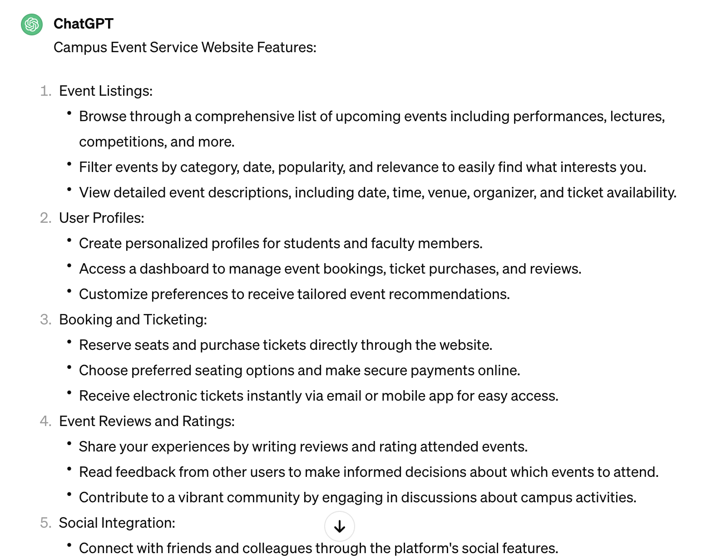

# Project Proposal

## 1. Project Overview

​	On the SUSTech campus, there is a wide variety of channels for releasing information about events, covering a wide range of methods such as emails, public numbers, QQ groups, and so on. However, this diversity also brings some inconvenience to students and faculty. For example, students who want to participate in an event need to search for the availability of relevant information on various channels, which causes a certain degree of inconvenience. In addition, organizers who hold events also need to release information about the event on different channels, while there may be many different forms of registration, such as using questionnaire stars, WeChat groups, or filling out Tencent documents. 

​	To address these issues and make life easier for SUSTech students and faculty, we plan to develop a comprehensive campus event service website. The site will allow SUSTech students and faculty to *browse information about various performances (e.g., musical concerts), lectures, competitions and other events on campus*, and provide functions such as *booking, purchasing tickets and writing reviews*.

#### Target users

- SUSTech students and faculty members

#### Functionalities

- As for students, they can participate in and share activities hold by verified hosts using words, photos or videos. What's more, they can interact with other students in the comment area.
- As for hosts, they can publish many activities, inviting students to enter them.
- All of the students and hosts can make comments for activities, or reply to other comments

#### Overall goal

We aim to construct a huge online platform which serves mainly for students. Students are able to take part in various kinds of activities, enjoying their campus life and broadening their horizons.

## 2. Requirement Analysis

#### Functional requirements

- Event Listings:

  - Browse through a comprehensive list of upcoming events including performances, lectures, competitions, and more.
  - Filter events by category, date, popularity, and relevance to easily find what interests you.
  - View detailed event descriptions, including date, time, venue, organizer, and ticket availability.

- Enter an activity easily 

  Take part in an activity shown in your homepage, or search a specific event using its name or id.

- Sign up with verified identity 

  When signing up, please give your name and student ID number, aiming to ensure that you are a student in our university.

- Share enterred activities in different ways 

  After enjoying an activity, you can share it in your moments, using words, pictures, even videos.

- Make comments to others sharings and chat with others 

  Noticing an attractive activity, you can chat with other students to acquire more details, or answer others' questions.

- Hilarious and cute stickers 

  Send a sticker to make your chats more fun. They are totally free with a huge amount.

#### Non-functional requirements

- Usability
  Make it clear for users to interact with buttons and pages provided by the platform.
- Security
  Avoid malicious users and softwares from various kinds of attacks, for example, sql injection.
- Performance
  Improve the performance of services, i.e., response time optimization.

#### Data requirements

We need the list of students' id number and their names. They are stored in computers of Student Affairs Department.

#### Technical requirements

The root services is running in macOS Sonoma 14.4.

## 3. AI Usage

