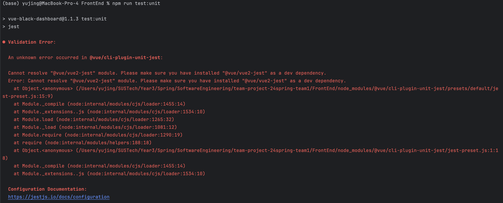
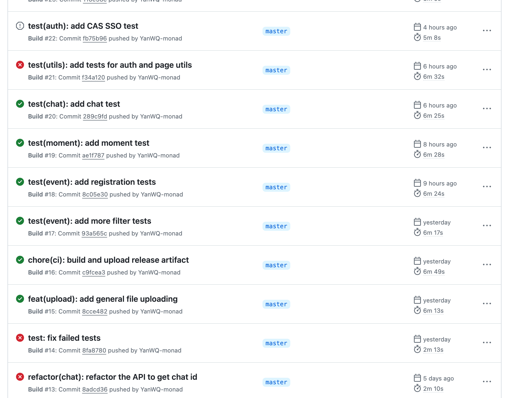
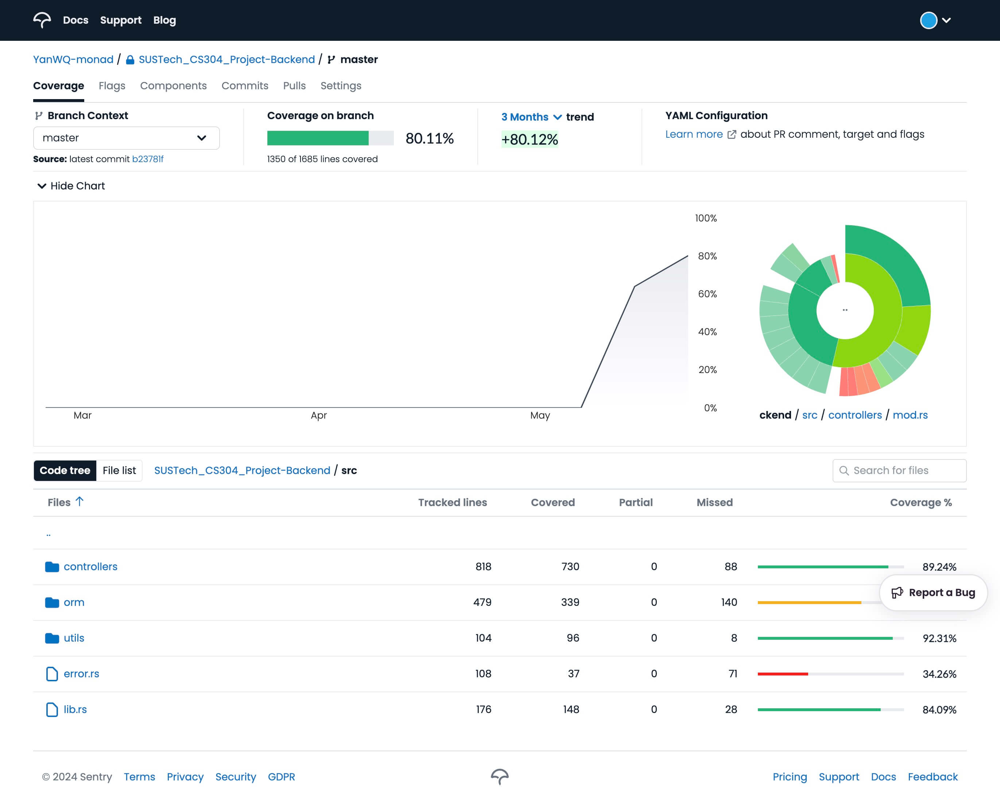
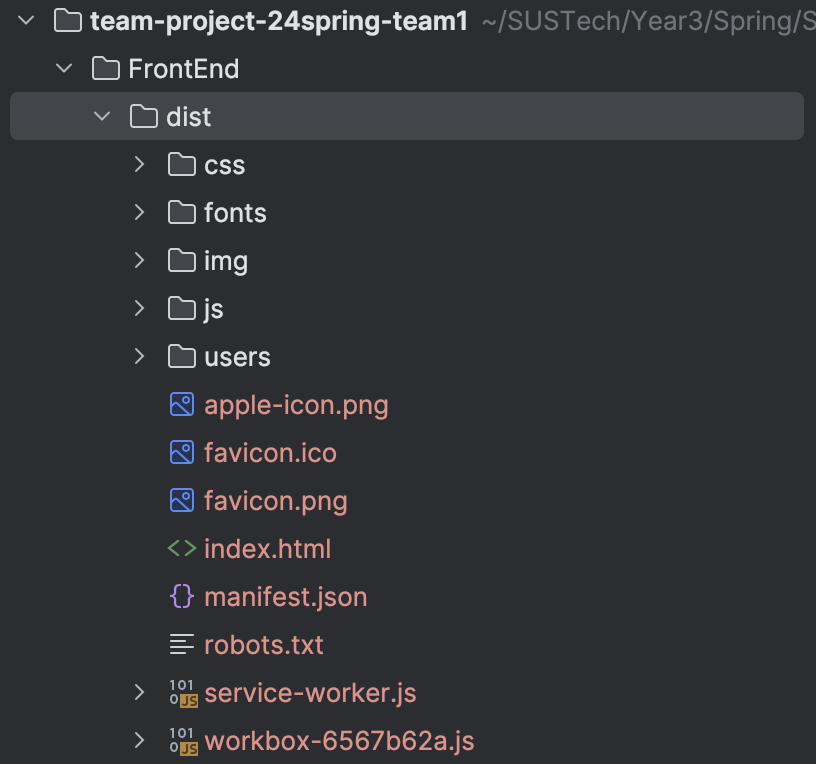
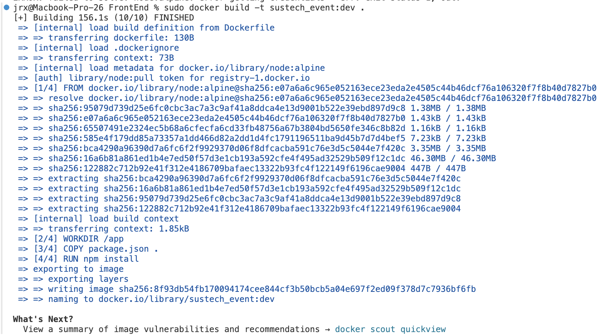
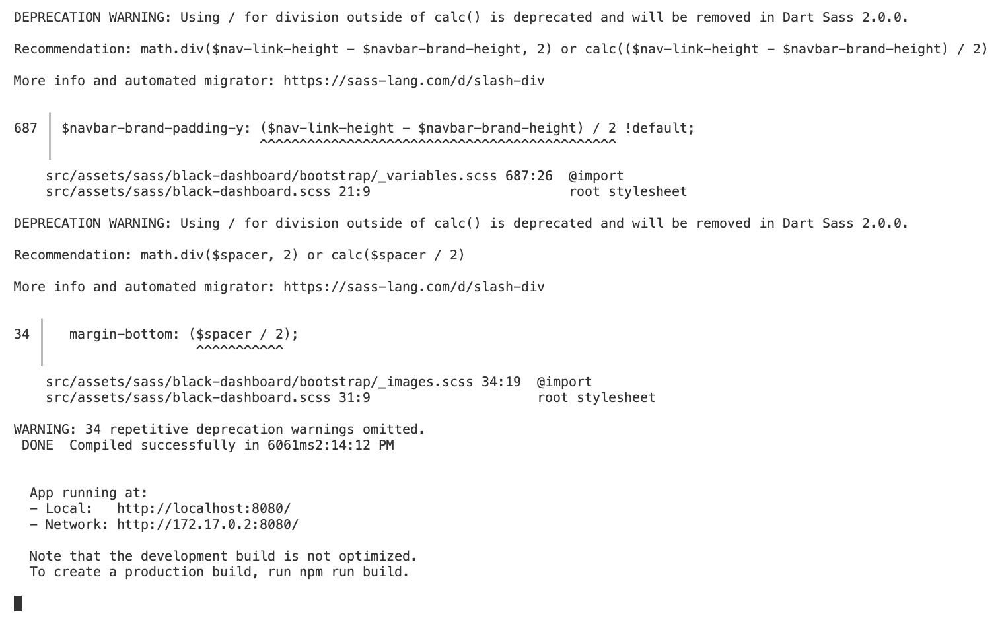
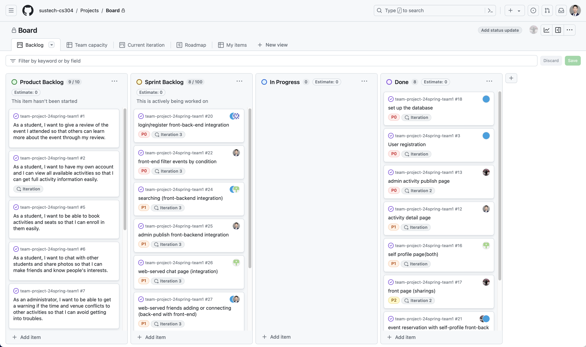
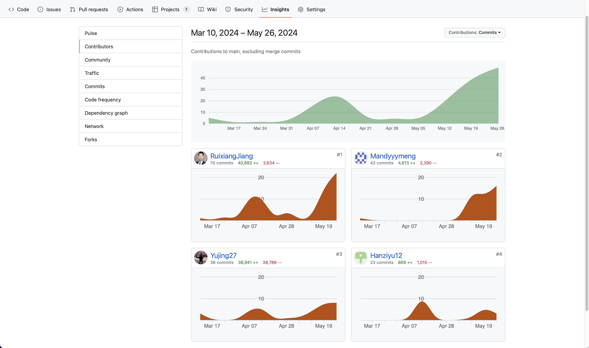
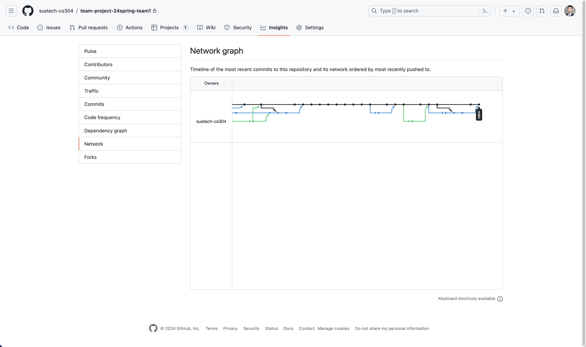

# Final-report-team1

## 1. Metrics

#### FrontEnd

- Lines of Code 

  - Tool Used: `cloc`

  - Command: `cloc src/`

  - Result: 21502 lines of code

    | Language        | Files | Blank Lines | Comment Lines | Code Lines |
    | --------------- | ----- | ----------- | ------------- | ---------- |
    | SCSS            | 140   | 2312        | 1215          | 12136      |
    | Vuejs Component | 62    | 441         | 391           | 7563       |
    | JavaScript      | 30    | 99          | 82            | 1099       |
    | CSS             | 2     | 136         | 28            | 456        |
    | JSON            | 2     | 0           | 0             | 232        |
    | SVG             | 12    | 0           | 0             | 12         |
    | YAML            | 1     | 4           | 13            | 5          |
    | **Total**       | 249   | 2992        | 1729          | 21503      |

- Number of packages/modules 

  - Tool Used: Manual count via the `package.json` file
  - Result: 14 (dependencies) + 23 (devDependencies) = 37

- Number of source files

  - Tool Used: `find` command in the terminal
  - Command: `find src/ -type f -name "*.vue" -or -name "*.js" | wc -l`
  - Result: 93 source files

-  Number of dependencies

  - Tool Used: `npm list --depth=0`
  - Command: `npm list --depth=0`
  - Result: 36 dependencies

- Lines of Code and Number of Source Files

  ```
  $ cloc . --exclude-dir=target

  -----------------------------------------------------------------------------------
  Language                         files          blank        comment           code
  -----------------------------------------------------------------------------------
  Rust                                44            662             38           3909
  Markdown                             1            244              0            753
  Windows Resource File                1             84           1370            462
  YAML                                 5             32              0            198
  SQL                                  4             19             18            125
  JavaScript                           1             20             56             54
  TOML                                 3              9              3             54
  Nix                                  1              4              0             42
  Python                               2             12             22             41
  Dockerfile                           2              9              7             16
  Bourne Again Shell                   1              3              5             11
  Text                                 1              0              0              2
  -----------------------------------------------------------------------------------
  SUM:                                66           1098           1519           5667
  ```

- Number of dependencies 

  - Tool Used: Manual count in `Cargo.toml` and `Cargo.lock`
  - Result: 30 dependencies

## 2. Documentation

Please refer to `readme.md` and `readme_for_developer.md`.

## 3. Tests

#### FrontEnd

We've encountered some challenges while using Jest for testing, which has prevented us from employing automated scripts. As a result, we've switched to manual testing for the time being. While this increases the time and effort required for testing, it provides us with a more intuitive testing process, allowing for a deeper understanding of the code's behavior and potential issues. Although manual testing may not be as efficient as automation, we remain committed to ensuring code quality and are actively working to address the current challenges so that we can resume automated testing as soon as possible. There are some figures that show our error.

Our manual testing primarily involves the following processes: console output and network packet capture.

1. **Console Output**: During manual testing, we carefully monitor the console output generated by our FrontEnd components. This involves checking for any error messages, warnings, or debug information that might indicate issues with the code. By examining the console output, we can identify potential bugs, unexpected behaviors, or performance issues that need to be addressed.
2. **Network Packet Capture**: Another crucial aspect of our manual testing process is capturing network packets to analyze the communication between the FrontEnd and backend systems. We use tools like Wireshark or browser developer tools to intercept and inspect the HTTP requests and responses exchanged during application operation. This allows us to verify that the FrontEnd correctly interacts with the backend services, as well as identify any anomalies, such as incorrect data transmission, slow response times, or unexpected server errors. By thoroughly examining network traffic, we ensure the integrity, security, and efficiency of our application's communication channels.

These manual testing procedures enable us to meticulously assess the behavior and performance of our FrontEnd components, ensuring they meet the desired specifications and deliver a seamless user experience.

#### Backend

Here we use Rust's unit testing and Actix-web's integration testing framework to test backend.
The integration tests are placed in a separated directory [`tests`](https://github.com/sustech-cs304/team-project-24spring-team1/tree/master/tests),
whose traffic flows only inside the application when testing.
This approach can avoid depending on the complex and changeable network environment,
and provide a higher reproducibility.

The tests are of course automated.
We have GitHub Actions configurated to build the source code and run the test cases
every time we push new commits to GitHub.
Besides testing the correctness of the code, we also check the code format in CI.



To detect and track the effectiveness of our tests,
While CI runs tests, we also collect its coverage.
The coverage will be uploaded to Codecov.io, which can provide a online dashboard for the coverage result,
and help us track the change of coverage between commits.

Currently, our tests can achieve the coverage of up to 80%,
and, the remaining 20% are mostly the declarations of structs.
These lines should not be counted as coverable lines,
but it's coverage tool's problem, not ours.



## 4. Build

#### Tools

Node.js and npm: Used for managing project dependencies and running build scripts.

#### Tasks Executed in a Build

1. Dependency Installation: Use `npm install` to install all necessary dependencies for the project.
2. Compilation and Packaging: Use `npm run build` to compile the source code and produce the final deployable artifacts.

#### Build Process

- In the `vue.config.js` file, add `publicPath: './',` to `module.exports`
- Run `npm run build` in the `FrontEnd` folder.
- Find `dist` folder, open `index.html` in browser.

#### Final Artifacts

**dist folder**:



**index.html**:


**backend**:

See GitHub Action artifacts, it's built automatically.

## 5. Deployment

In the `FrontEnd` folder:
- Create `Dockerfile` and `.dockerignore` files
  The `Dockerfile` is:
  ```
  FROM node:alpine
  WORKDIR /app
  COPY package.json .
  RUN npm install
  CMD ["npm", "run", "serve"]
  ```
  The `.dockerignore` file is:
  ```
  node_modules
  .git
  .gitignore
  dist
  ```
  
- Run `sudo docker build -t sustech_event:dev .` to create the docker image named `sustech_event`
  
  Note that if it raises an error `ERROR [internal] load metadata for docker.io/library/node:alpine`, please change the `credsStore` value in `$HOME/.docker/config.json` from `desktop` to `osxkeychain`.
  The result is:
  
  
  
- Run `docker run -v ${PWD}:/app -v /app/node_modules -p 8089:8080 sustech_event:dev` to launch at port 8089

    The result is:

    

    

- Publish the image `sustech_event` to DockerHub

#### Backend

- We use the following `Dockerfile` to build backend image.
  ``` dockerfile
  FROM rust
  WORKDIR /build
  COPY . .
  RUN rustup target add x86_64-unknown-linux-musl \
   && cargo build --release --target x86_64-unknown-linux-musl --bin backend --features cli

  FROM scratch
  COPY --from=0 /etc/passwd /etc/passwd

  COPY --from=0 /build/target/x86_64-unknown-linux-musl/release/backend /backend
  CMD ["/backend"]
  ```
  The backend image are built from a scratch image,
  that is, there are only two file (`/etc/passwd` and `backend` binary) in the image (excluding kernel's filesystem),
  and it can further be set to read-only in `docker-compose.yml`,
  which could greatly harden our srever.

- We also use Docker Compose to deploy the environment, since backend involves multiple services.
  <details>
    <summary><code>docker-compose.yml</code></summary>

  ``` yml
    version: "3"

  services:
    db:
      image: postgres:16
      environment:
        POSTGRES_USER: "elaina"
        POSTGRES_PASSWORD: "baguette"
        POSTGRES_DB: "robetta"
      volumes:
        - "db:/var/lib/postgresql/data"

    traefik:
      image: traefik:v2.11
      ports:
        - "127.0.0.1:8000:443"
      volumes:
        - "/run/user/1000/podman/podman.sock:/var/run/docker.sock"
        - "./dynamic.yml:/etc/traefik/dynamic.yml:ro,noexec"
        - "./traefik.yml:/etc/traefik/traefik.yml:ro,noexec"
        - "./certs:/etc/traefik/certs:ro"

    image:
      image: image-hosting
      build: ../services/image-hosting
      pull_policy: never
      read_only: true
      volumes:
        - "../target/uploads:/app/uploads:noexec"
      labels:
        - "traefik.enable=true"
        - "traefik.http.services.image.loadbalancer.server.port=8000"

    backend:
      image: backend
      build:
        context: ..
        dockerfile: docker/backend-bin.Dockerfile
      pull_policy: never
      read_only: true
      depends_on:
        - db
      environment:
        DATABASE_URL: "postgres://elaina:baguette@db/robetta"
        JWT_SECRET: "......"
        HOST: "0.0.0.0"
      labels:
        - "traefik.enable=true"
        - "traefik.http.services.backend.loadbalancer.server.port=8080"

    frontend:
      image: frontend
      read_only: true
      labels:
        - "traefik.enable=true"
        - "traefik.http.services.backend.loadbalancer.server.port=8080"

  volumes:
    db:
  ```

  </details>


## 6. Collaborations

-   Git board

    

-   Git contributors

    

-   Git network

    
