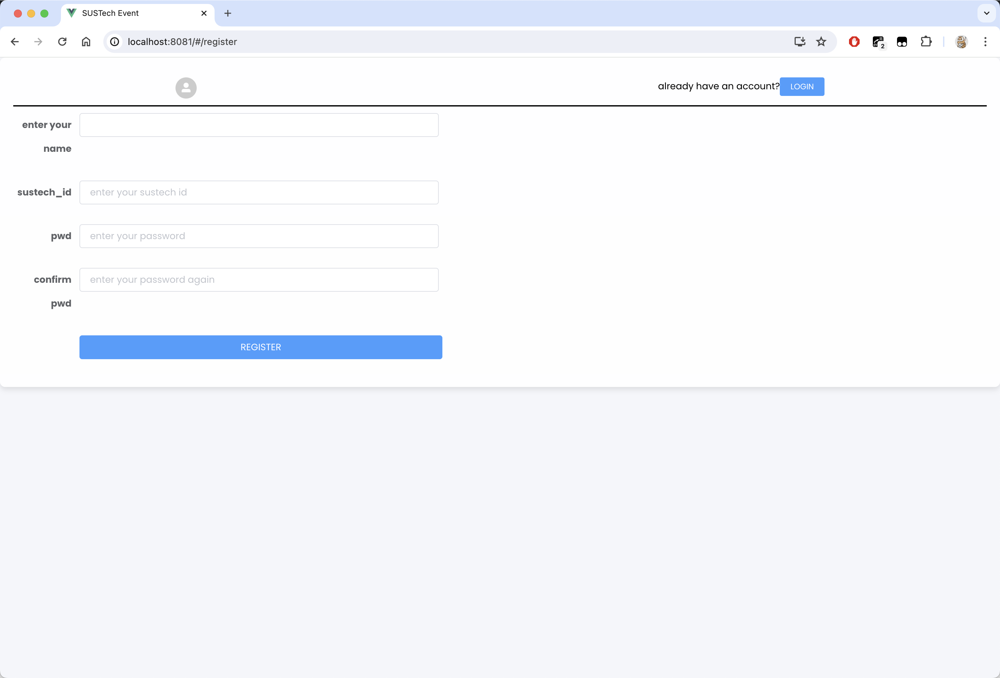
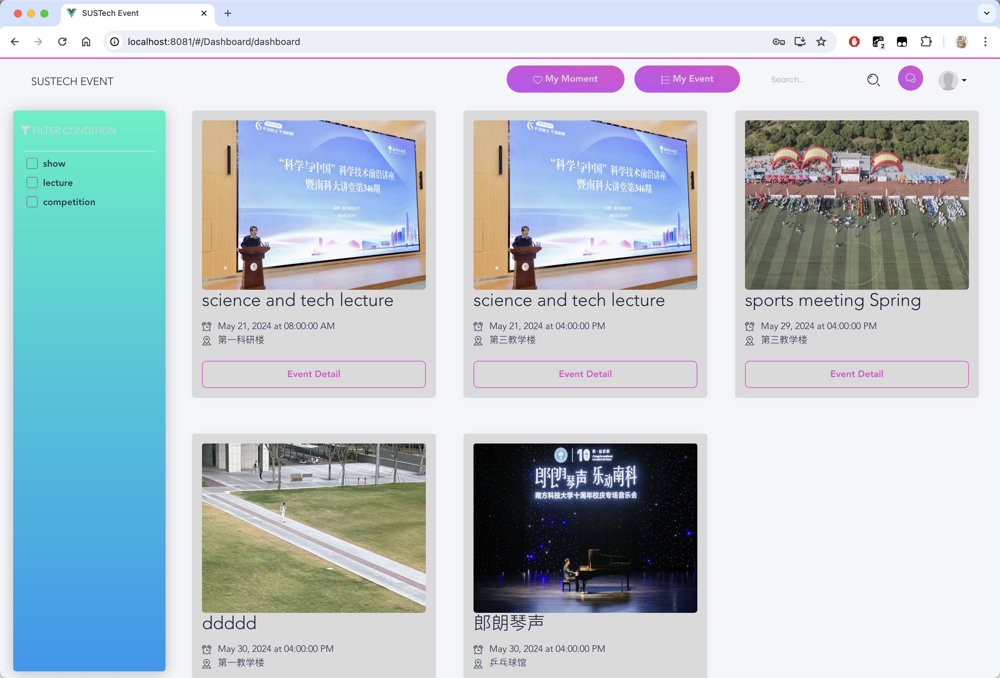
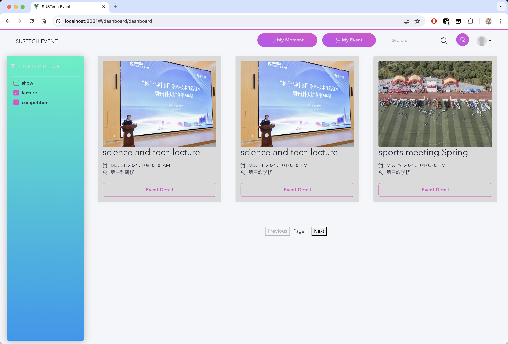
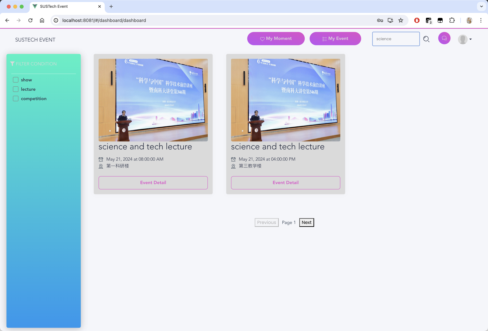
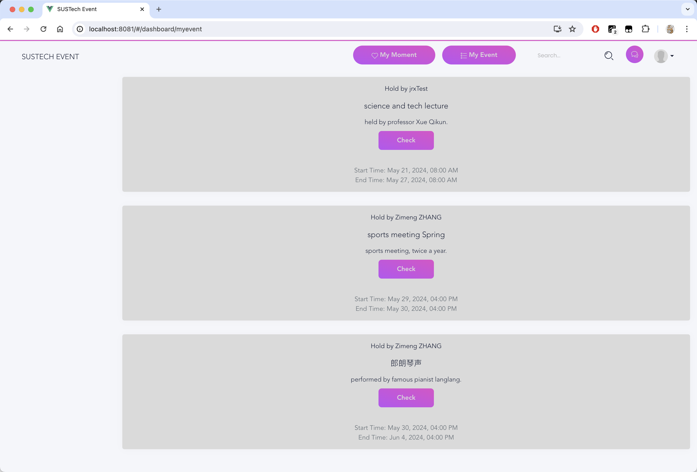
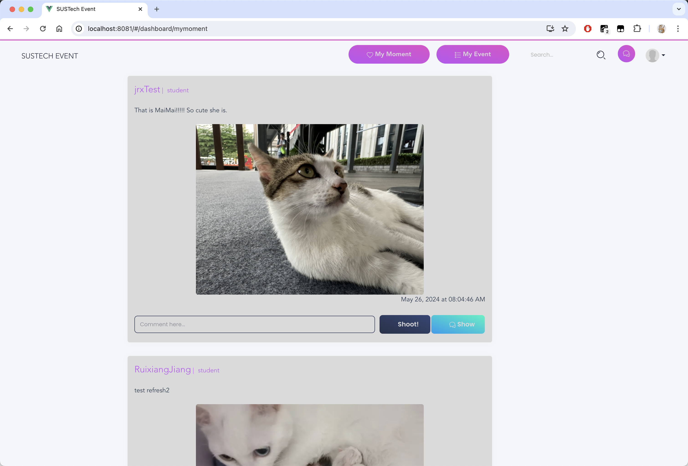
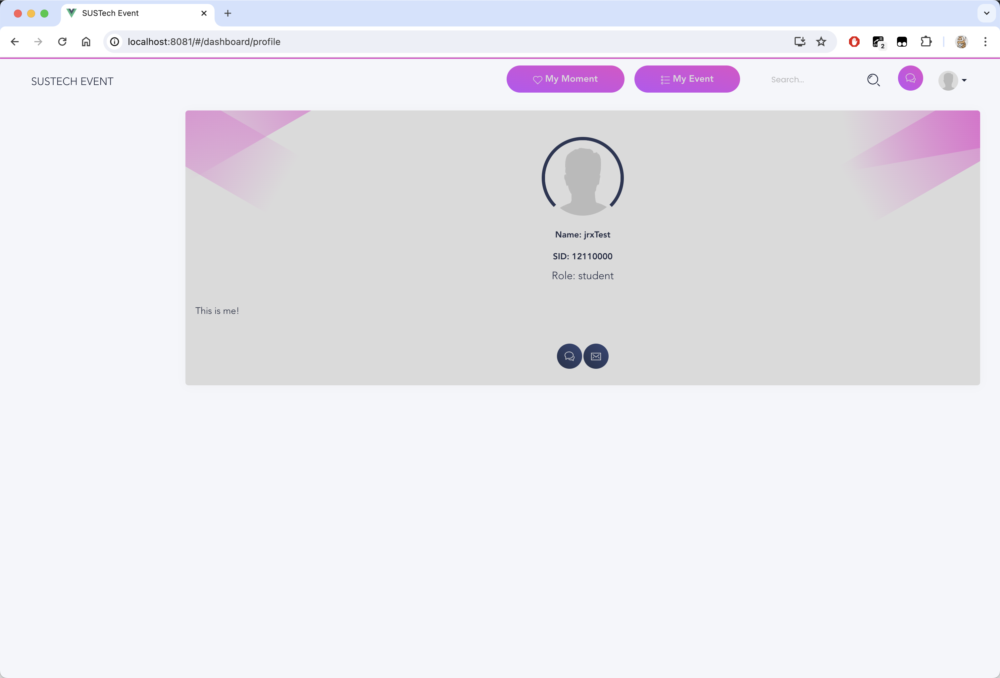

# SUSTech Event

On the SUSTech campus, there is a wide variety of channels for releasing information about events, covering various methods such as emails, public numbers, QQ groups, etc. However, this diversity also brings some inconvenience to students and faculty. For example, students who want to participate in an event need to search for the availability of relevant information on various channels, which causes a certain degree of inconvenience. In addition, event organizers also need to release information about the event on different channels. At the same time, there may be many different registration forms, such as using questionnaire stars, WeChat groups, or filling out Tencent documents. 

We plan to develop a comprehensive campus event service website to address these issues and make life easier for SUSTech students and faculty. The site will allow SUSTech students and faculty to browse information about various performances (e.g., musical concerts), lectures, competitions, and other events on campus and provide functions such as booking, purchasing tickets, and writing reviews. 

That is SUSTech Event, an open-source, lightweight event management system for students in SUSTech, based on Vue.

## Features

-   Responsive user interface
-   Visitor / CAS authentication for registration and login
-   Event list
-   Moment list

-   Comment
-   Chat room
-   Hilarious and cute stickers
-   Support images and videos
-   Security

## Installation

### Requirements

Before building SUSTech Event from the source, you must install several prerequisites. First, you must install NPM using `sudo apt install npm` in Linux or `brew install npm` in MacOS. After that, you can enter the dictionary of `package.json` and run `npm install` to install all compulsory packages. Finally, run `npm run serve` to launch the project.

It's highly recommended that you could use Google Chrome to visit the website.

### Build

In the dictionary of `package.json`, you can run `npm run build` to generate the `dist` folder.

## Login & Register

### Login

Note that you can log in as a visitor or through CAS. If you want to log in as a visitor, as you don't have a visitor account, you can click `no account? register now` to register a visitor account.

### Register

To log in as a visitor, you should register by providing your SID, name, and password. Your email address will be set to `SID + @mail.sustech.edu.cn` as default, which can be changed on the profile page.

## Event

### Browse events

After logging in successfully, you will be redirected to an event browse page, which is the home page.

As is shown above, you can select preferred events to participate in. The home page contains three parts, top bar, leftside bar, and the main area. The `My Moment` button and the two icon buttons in the rightmost of the top bar will be introduced in further sections.

Basically, the main area shows events you can choose to enter by clicking `Event Detail`. The events are of four types, show, lecture, competition, and others. You can use the filter button in the left bar to select events that have the specified type. If you choose none of the types, it will show all of the events.

Take events whose types are `lecture` or `competition` as an example.

What's more, the search area in the top bar can help you find events by the name.

Take events whose names contain `science` as an example.

### Event details

If you find an event that you are interested in, you can see the details after clicking `Event Detail`.

**Todo: picture**

Here you can check the time, place, holder, and tickets remaining. You can click `Register` to note that you will attend it.

What's more, you can make a comment and look through others' comments. You can click the name to see the student's profile, and get in touch to him/her if needed, which will be introduced later.

### My events

You can check your events that you have entered or will enter. You can click `Check` to verify details.

## Moment

This page shows "moments" published by all the users. Actually, it is very similar to Tencent Qzone. You can enjoy others' moments and comment to them.

Click the `shoot!` to make a comment, and click `Show` to show all the comments corresponding to the moment.

You can also publish your moment which can contain at most one picture.

The time format is polished, which makes the interface more hommization.

## Profile

Click the avatar button in the top bar, you can check or modify your profile.

### Profile

The profile page contains some basic information of you, which is public to every user. Users can see your avatar, name, SID, role, and a short description. What's more, the chat button can construct a chat room of you and the user corresponds to the profile page, and the email button allows you to write an email to the user. Note that you are not able to chat with yourself.

After registration, you will be given a default avatar shown below and a default email address in `SID + @mail.sustech.edu.cn`. You can change your profile in the setting page.

