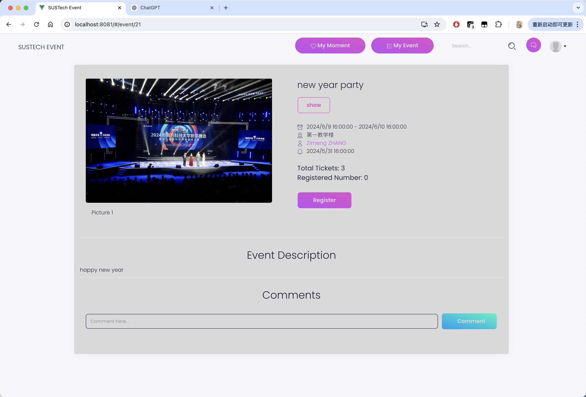
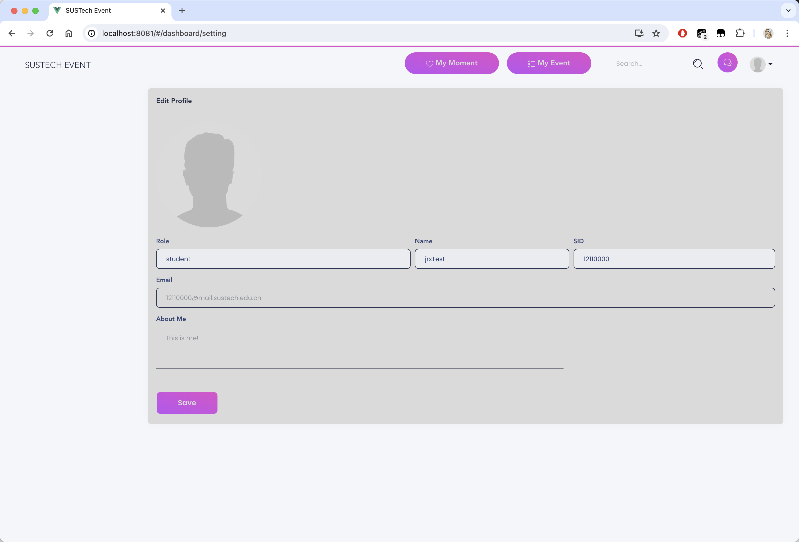
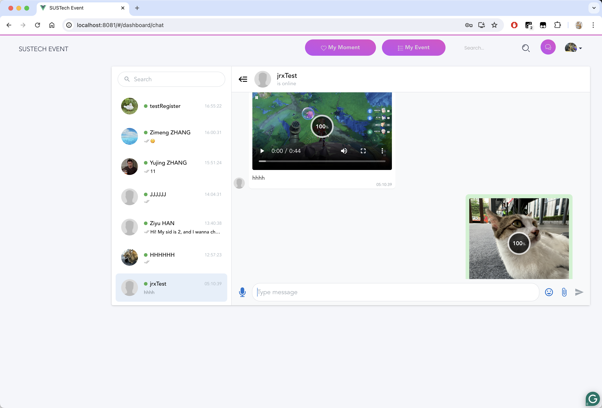
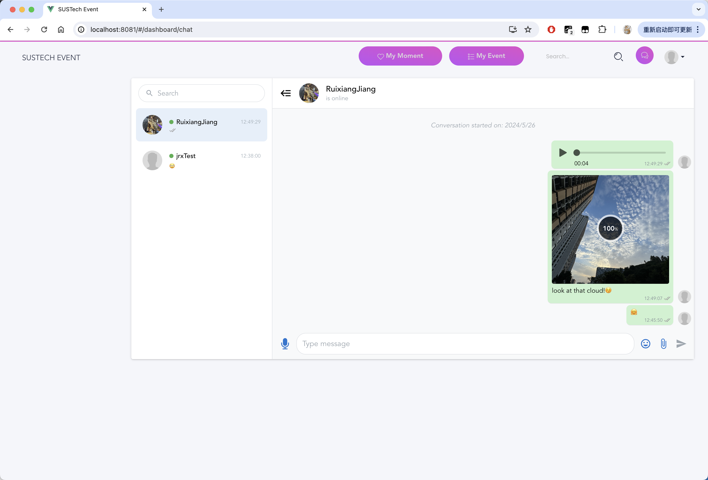
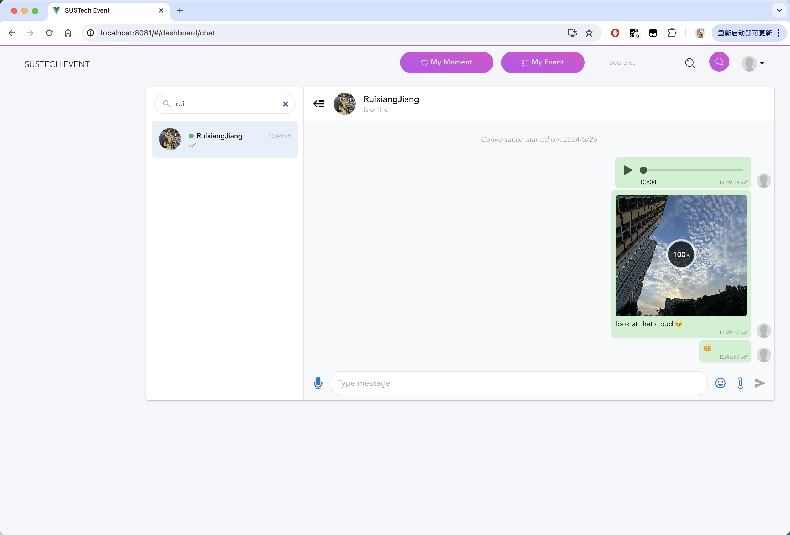

# SUSTech Event

On the SUSTech campus, information about events is disseminated through various channels, including emails, public announcements, QQ groups, and more. However, this diversity can lead to inconvenience for students and faculty. For example, students who want to participate in an event need to search for relevant information across multiple channels, which can be cumbersome. Additionally, event organizers must disseminate information about events on various platforms, often using different registration forms, such as questionnaires, WeChat groups, or Tencent documents.

To address these issues and simplify life for SUSTech students and faculty, we plan to develop a comprehensive campus event service website. This site will allow users to browse information about various events, such as musical concerts, lectures, competitions, and more. It will also provide functionalities like booking, purchasing tickets, and writing reviews.

Introducing SUSTech Event, an open-source, lightweight event management system for SUSTech students, based on Vue.

## Features

- Responsive user interface
- Visitor / CAS authentication for registration and login
- Event list
- Moment list
- Comments
- Chat room
- Hilarious and cute stickers
- Support for images and videos
- Security

## Installation

### Requirements

Before building SUSTech Event from the source, you must install several prerequisites. First, install NPM using `sudo apt install npm` on Linux or `brew install npm` on macOS. After that, navigate to the directory containing `package.json` and run `npm install` to install all necessary packages. Finally, run `npm run serve` to launch the project.

It is highly recommended to use Google Chrome to visit the website.

### Build

In the directory containing `package.json`, you can run `npm run build` to generate the `dist` folder.

## Login & Register

### Login

Note that you can log in as a visitor or through CAS. If you want to log in as a visitor and do not have an account, click `no account? register now` to register a visitor account.

### Register

To log in as a visitor, you should register by providing your SID, name, and password. Your email address will be set to `SID + @mail.sustech.edu.cn` by default, which can be changed on the profile page.

## Event

### Browse events

After logging in successfully, you will be redirected to the event browsing page, which is the home page.

As shown above, you can select preferred events to participate in. The home page contains three parts: the top bar, the left sidebar, and the main area. The `My Moment` button and the two icon buttons on the far right of the top bar will be introduced in further sections.

Basically, the main area shows events you can choose to enter by clicking `Event Detail`. The events are of four types: show, lecture, competition, and others. You can use the filter button in the left bar to select events of a specified type. If you choose none of the types, it will show all the events.

Take events whose types are `lecture` or `competition` as an example.

Additionally, the search area in the top bar can help you find events by name.

Take events whose names contain `science` as an example.

### Event details

If you find an event that you are interested in, you can see the details after clicking `Event Detail`.

Here you can check the time, place, organizer, and tickets remaining. You can click `Register` to note that you will attend it.

Additionally, you can make a comment and view others' comments. You can click the name to see the student's profile and get in touch with them if needed, which will be introduced later.

### My events

You can check the events you have entered or will enter. You can click `Check` to verify details.

## Moment

This page shows "moments" published by all users. It is similar to Tencent Qzone. You can enjoy others' moments and comment on them.

Click `shoot!` to make a comment, and click `Show` to display all comments related to the moment.

You can also publish your own moment, which can contain at most one picture.

The time format is polished, enhancing the user experience.

## Profile

Click the avatar button in the top bar to check or modify your profile.

### Profile

The profile page contains basic information about you, which is public to every user. Users can see your avatar, name, SID, role, and a short description. Additionally, the chat button can initiate a chat room with the user corresponding to the profile page, and the email button allows you to send an email to the user. Note that you cannot chat with yourself.

After registration, you will be given a default avatar (shown below) and a default email address in the format `SID + @mail.sustech.edu.cn`. You can change your profile in the settings page.

### Setting

You can modify your personal information here. Note that some of the information cannot be changed.

To change your avatar, click the current avatar and upload a new image. You are not able to edit the picture, and the image will be pressed into a circle as your new avatar.

## Chat

You can chat with others by clicking the chat button in the top bar.

Note that you can only initiate contact with a new user through their profile page. On another user's profile page, once you click the chat button (shown in the profile section), a chat room containing you and that user will be created by sending a message saying `Hi! My SID is {your SID}, and I want to chat with you!` from you to that user.

- The chat page supports various kinds of messages, including text, images, videos, and emojis. You can watch videos online.

- The chat page supports instant communication. That means if someone sends a message to you, you can receive it within 2 seconds without refreshing the page.

- The chat page supports searching for a specified user by name.

- The chat page supports folding the user bar.

